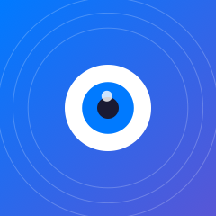

<div align="center">

<picture>
  <source media="(prefers-color-scheme: dark)" srcset="Assets/AppIcon-Preview.png">
  <source media="(prefers-color-scheme: light)" srcset="Assets/AppIcon-Preview.png">
  
</picture>

# Visual Assist

### Empowering independence through intelligent visual assistance

<br>

> ⚠️ **BETA VERSION** — This app is currently in active development and testing. Features may change and bugs may exist. [Report issues →](../../issues)

<br>

[](https://developer.apple.com/ios/)
[](https://swift.org)
[](https://developer.apple.com/xcode/)
[](LICENSE)

<br>


<br>

**[Features](#-features)** · **[Requirements](#-requirements)** · **[Getting Started](#-getting-started)** · **[Architecture](#-architecture)** · **[Privacy](#-privacy)**

<br>


</div>

<br>

---

<br>

## 🎯 Overview

**Visual Assist** is a native iOS application designed to help visually impaired users navigate their environment safely and independently. Built with Apple's latest frameworks, it leverages the power of:

<table>
<tr>
<td align="center" width="25%">
<br>
<strong>LiDAR + ARKit</strong><br>
<sub>Depth Sensing</sub>
</td>
<td align="center" width="25%">
<br>
<strong>Vision</strong><br>
<sub>Text Recognition</sub>
</td>
<td align="center" width="25%">
<br>
<strong>Core ML</strong><br>
<sub>Object Detection</sub>
</td>
<td align="center" width="25%">
<br>
<strong>SwiftUI</strong><br>
<sub>Modern Interface</sub>
</td>
</tr>
</table>

<br>

---

## 🧪 Beta Status

<table>
<tr>
<td width="100">


</td>
<td>

**Visual Assist is currently in beta testing.** 

This means:
- 🔨 **Active Development** — New features being added regularly
- 🐛 **Bug Fixes** — Known issues are being addressed
- 📝 **Feedback Welcome** — Your input helps improve the app
- ⚠️ **Not Production Ready** — Use with awareness of potential issues

</td>
</tr>
</table>

### Known Limitations

| Area | Status | Notes |
|:-----|:------:|:------|
| Navigation Mode | ✅ Working | Core functionality complete |
| Text Reading | ✅ Working | OCR may vary with lighting |
| Object Detection | 🔄 Testing | Accuracy improvements ongoing |
| Voice Commands | ✅ Working | English only for now |
| Apple Watch | �� Planned | Coming in future release |

<br>

---

## ✨ Features

<table>
<tr>
<td width="33%" valign="top">

### 🧭 Navigation Mode

Real-time obstacle detection powered by LiDAR sensor technology.

| Feature | |
|:--------|:--|
| 3-Zone Scanning | ✓ |
| Distance Alerts | ✓ |
| Haptic Feedback | ✓ |
| Floor Detection | ✓ |

</td>
<td width="33%" valign="top">

### 📖 Text Reading

Point-and-read OCR with natural speech synthesis.

| Feature | |
|:--------|:--|
| Live OCR | ✓ |
| Freeze Frame | ✓ |
| Natural Speech | ✓ |
| Tap to Focus | ✓ |

</td>
<td width="33%" valign="top">

### 👁️ Object Awareness

AI-powered scene understanding and description.

| Feature | |
|:--------|:--|
| Object Detection | ✓ |
| Scene Description | ✓ |
| People Counting | ✓ |
| On-Device ML | ✓ |

</td>
</tr>
</table>

<br>

### 🎤 Voice Commands

<table>
<tr>
<td width="50%">

```
🗣️ "Navigate"           → Start obstacle detection
🗣️ "Read text"          → Begin text reading
🗣️ "What's around me"   → Describe surroundings
```

</td>
<td width="50%">

```
🗣️ "Stop"               → Stop current action
🗣️ "Faster" / "Slower"  → Adjust speech rate
🗣️ "Help"               → List all commands
```

</td>
</tr>
</table>

<br>

---

## 📋 Requirements

<table>
<tr>
<td width="50%">

### 📱 Hardware

| Device | LiDAR |
|:-------|:-----:|
| iPhone 12 Pro / Pro Max | ✓ |
| iPhone 13 Pro / Pro Max | ✓ |
| iPhone 14 Pro / Pro Max | ✓ |
| iPhone 15 Pro / Pro Max | ✓ |
| iPhone 16 Pro / Pro Max | ✓ |

</td>
<td width="50%">

### 💻 Software

| Requirement | Version |
|:------------|:--------|
| **iOS** | 17.0+ |
| **Xcode** | 15.0+ |
| **Swift** | 5.9+ |

### 🔑 Permissions

- 📷 Camera
- 🎤 Microphone
- 🗣️ Speech Recognition

</td>
</tr>
</table>

<br>

---

## 🚀 Getting Started

### Installation

```bash
# Clone the repository
git clone https://github.com/yadava5/VisualAssist.git

# Navigate to project
cd VisualAssist

# Open in Xcode
open VisualAssist.xcodeproj
```

### Build & Run

| Step | Action |
|:----:|:-------|
| 1️⃣ | Select your **Development Team** in Signing & Capabilities |
| 2️⃣ | Connect your **iPhone Pro** via USB |
| 3️⃣ | Press <kbd>⌘</kbd> + <kbd>R</kbd> to build and run |

### First Launch

> Grant permissions → App announces "Visual Assist ready" → Start using!

<br>

---

## 🏗️ Architecture

```
VisualAssist/
├── 📁 App/                    # Entry point & state
│   ├── VisualAssistApp.swift
│   └── AppState.swift
├── 📁 Views/                  # SwiftUI interface
│   ├── HomeView.swift
│   ├── NavigationModeView.swift
│   ├── TextReadingModeView.swift
│   ├── ObjectAwarenessModeView.swift
│   └── Components/
├── 📁 Services/               # Business logic
│   ├── LiDARService.swift
│   ├── CameraService.swift
│   ├── SpeechService.swift
│   └── HapticService.swift
├── 📁 Models/                 # Data structures
└── 📁 Utilities/              # Helpers
```

### Technology Stack

| Framework | Purpose | |
|:----------|:--------|:-:|
| **ARKit** | LiDAR depth sensing | 🔵 |
| **Vision** | Text recognition (OCR) | 🟢 |
| **Core ML** | Object detection | 🟣 |
| **AVFoundation** | Camera capture | 🟠 |
| **Speech** | Voice commands | 🔴 |
| **Core Haptics** | Haptic feedback | 🟡 |

### Design Patterns

| Pattern | Usage |
|:--------|:------|
| **MVVM** | Clean view/logic separation |
| **Combine** | Reactive `@Published` properties |
| **Swift Concurrency** | Modern async/await |
| **iOS 26 Design** | Liquid glass UI effects |

<br>

---

## �� Privacy

<div align="center">

| | Feature | Description |
|:-:|:--------|:------------|
| 🔐 | **On-Device Processing** | All ML runs locally on your iPhone |
| 📡 | **No Network Required** | Works completely offline |
| 🚫 | **No Data Collection** | Nothing leaves your device |
| 📊 | **No Analytics** | Zero tracking or telemetry |
| 👤 | **No Account** | Use immediately, no sign-up |

</div>

<br>

---

## ♿ Accessibility

Visual Assist is built with accessibility as a core principle:

<table>
<tr>
<td width="50%">

### VoiceOver & UI

- ✅ Full **VoiceOver** support
- ✅ **Dynamic Type** compatible
- ✅ **High Contrast** mode
- ✅ **Reduce Motion** respected
- ✅ Large touch targets (44pt min)

</td>
<td width="50%">

### Haptic Patterns

| Pattern | Meaning |
|:--------|:--------|
| `·` | Action confirmed |
| `··` | Mode changed |
| `~~~` | Critical obstacle |
| `···` | Warning |

</td>
</tr>
</table>

<br>

---

## 🗺️ Roadmap

- [ ] ⌚ Apple Watch companion app
- [ ] 🗺️ Indoor mapping & saved locations
- [ ] 💵 Currency recognition
- [ ] 🌍 Multi-language support
- [ ] 🔗 Siri Shortcuts integration
- [ ] 🚗 CarPlay navigation support

<br>

---

## 📜 License

<table>
<tr>
<td>

This project is licensed under the **Creative Commons Attribution-NonCommercial 4.0 International License**.

| Permission | |
|:-----------|:-:|
| ✓ Share — Copy and redistribute | ✅ |
| ✓ Adapt — Remix and build upon | ✅ |
| ✗ Commercial use without permission | ❌ |

For commercial licensing, contact the author.

</td>
<td width="200" align="center">

[](LICENSE)

**[View License](LICENSE)**

</td>
</tr>
</table>

<br>

---

## 📚 Documentation

This project uses [**DocC**](https://www.swift.org/documentation/docc/) for API documentation.

```bash
# Build documentation in Xcode
# Product → Build Documentation (⌃⇧⌘D)

# Or via command line
xcodebuild docbuild -scheme VisualAssist -derivedDataPath ./docs
```

<br>

---

<div align="center">

<br>

**Built with ❤️ for accessibility**

<sub>© 2026 Ayush. All rights reserved.</sub>

<br>


<sub>Visual Assist is not affiliated with Apple Inc.<br>
iPhone, LiDAR, ARKit, and other Apple trademarks are property of Apple Inc.</sub>

<br>

[](https://swift.org)
[](https://developer.apple.com/ios/)

</div>
