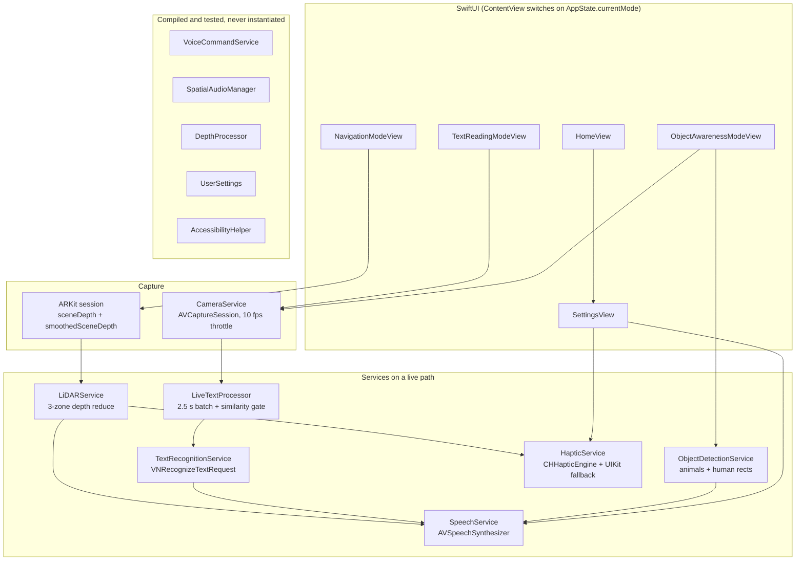

<p align="center">
  
  
</p>

<h1 align="center">Visual Assist</h1>

<p align="center">
  <strong>A native iOS navigation aid for blind and low-vision users that reduces a LiDAR depth map to three spoken distances — left, ahead, right — and speaks them before you walk into anything.</strong>
</p>

<p align="center">
  <a href="#features">Features</a> •
  <a href="#architecture">Architecture</a> •
  <a href="#accessibility">Accessibility</a> •
  <a href="#testing">Testing</a> •
  <a href="#getting-started">Getting Started</a> •
  <a href="#verify-it">Verify it</a>
</p>

<p align="center">
  
  
  
  
  
</p>

<p align="center">
  <a href="https://github.com/yadava5/VisualAssist/actions/workflows/ci.yml"></a>
  <a href="https://github.com/yadava5/VisualAssist/actions/workflows/codeql.yml"></a>
  <a href="https://github.com/yadava5/VisualAssist/actions/workflows/gitleaks.yml"></a>
</p>

> **Beta.** Three modes ship and work on device. Several things the earlier README listed as working
> are not wired into the app at all, and they are enumerated by name in
> [Implemented vs delegated vs planned](#implemented-vs-delegated-vs-planned). Read that section
> before you read anything else here. In an assistive product an overstated capability is not a
> marketing problem, it is a safety problem, so this README names every gap rather than rounding it
> to a checkmark.

---

## Overview

Visual Assist is an iPhone app for people who cannot see the obstacle in front of them. In Navigation
mode it runs an `ARWorldTrackingConfiguration` with `sceneDepth` enabled, reduces each LiDAR depth
frame to the nearest valid return in three horizontal zones, and announces the closest one through
`AVSpeechSynthesizer` with a matching Core Haptics pattern. Two other modes reuse the camera without
depth: Text Reading runs Vision OCR and reads the result aloud, and Object Awareness runs Vision's
animal and human detectors and describes what it found.

It is one Xcode project, 27 Swift files and 5,702 lines in the app target, written in SwiftUI
with `@MainActor` services published into the view tree. There are **no third-party dependencies** —
no `Package.resolved`, no `Podfile`, and zero `XCRemoteSwiftPackageReference` entries in
`VisualAssist.xcodeproj/project.pbxproj`. Every hard part is an Apple framework: ARKit for depth,
Vision for OCR and detection, AVFoundation for capture and speech, Core Haptics for feedback.

### Why it's interesting

- **The depth buffer is transposed and the code says so.** In portrait, ARKit's depth `CVPixelBuffer`
  has its axes swapped relative to the screen, so left/right zones index the buffer's *height*
  dimension, not its width. `LiDARService.processDepthFrame` carries a ten-line comment block deriving
  that mapping, and it is the one piece of genuinely non-obvious engineering in the repo.
- **Three numbers instead of a point cloud.** The whole obstacle model is `leftMin`, `centerMin`,
  `rightMin` over samples in `0 m < depth < 10 m`, strided by 4 in both axes. That is deliberately
  small; see [Technical decisions](#technical-decisions).
- **Live OCR is stabilised across frames, not read per frame.** `LiveTextProcessor` buffers up to
  5 frames on a 2.5 s timer, picks the frame whose text is most similar to the others, and speaks it
  only if Jaccard word similarity against the last utterance is below 0.7 — so the app does not
  re-read the same sign every two seconds.
- **71 tests, and the README is explicit that they cover the layer that is not the product.** All 8
  test classes exercise value types and one static utility. Nothing touches the sensor path, because
  the Simulator has neither a LiDAR sensor nor a camera. See [Testing](#testing).
- **Nothing leaves the device, and that is greppable.** The app target contains no `URLSession`, no
  `dataTask` and no HTTP call. The only `https://` string in it is a `Link` in `SettingsView` that
  hands a URL to Safari.

---

## Features

### Navigation mode — LiDAR obstacle distance

`LiDARService` runs an ARKit session with `.sceneDepth` and `.smoothedSceneDepth` frame semantics
(each inserted only if `supportsFrameSemantics` says so) and `.mesh` scene reconstruction. It prefers
the smoothed depth map and falls back to the raw one.

```
ARFrame.smoothedSceneDepth ?? ARFrame.sceneDepth   (CVPixelBuffer, Float32)
     │
     ▼   portrait: buffer Y axis runs screen RIGHT → LEFT
┌───────────────────────────────────────────────────────────────────┐
│  sample x in [width/4, 3·width/4), y in [0, height), stride 4      │
│  keep 0 m < depth < 10 m                                          │
│                                                                   │
│    y <  height/3      → RIGHT zone   min()                        │
│    y >= 2·height/3    → LEFT  zone   min()                        │
│    otherwise          → CENTER zone  min()                        │
│                                                                   │
│  also tracked: farthest valid return → on-screen "clear space" dot │
└───────────────────────────────────────────────────────────────────┘
     │
     ▼
nearest = min(left, center, right)   →   "on your left" / "ahead" / "on your right"
     │
     ├── < 0.50 m  critical  → haptic .critical  + speakNow("Stop! Obstacle …")
     ├── < 1.00 m  warning   → haptic .warning   + speakNow("Caution, …")
     └── < 2.00 m  caution   → shown on screen, not announced
```

Rate limiting is two independent cooldowns on `LiDARService`: haptics at most every 0.5 s,
speech at most every 3.0 s. The thresholds above are `let` constants on the service — the Settings
sliders do not reach them, which is stated again under
[planned, not in this build](#implemented-vs-delegated-vs-planned).

On screen: three zone cards with per-zone distances, a large nearest-obstacle readout, a green
indicator over the farthest measured point, and a debug overlay (bug icon) showing buffer size,
valid-sample count and the three raw minima.

### Text Reading mode — Vision OCR, spoken

`TextRecognitionService` runs `VNRecognizeTextRequest` at `.accurate` with
`usesLanguageCorrection = true` and `recognitionLanguages = ["en-US"]`; on iOS 16+ it also sets
`automaticallyDetectsLanguage = true`. Observations are sorted top-to-bottom then left-to-right
before being joined.

- **Freeze** — captures the current frame, OCRs it, announces the word count, draws boxes over each
  recognised block, and waits for you to press Read.
- **Live Read** — `LiveTextProcessor` collects camera frames (the capture path is throttled to 10 fps
  by `CameraService.frameProcessingInterval = 0.1`), batches up to 5 every 2.5 s, discards results
  under 3 words, picks the most self-similar text in the batch, and enqueues it for speech only if it
  differs from the last utterance by Jaccard word similarity below 0.7.
- **Tap to focus** — `FocusableCameraView` maps the tap into camera coordinates and sets
  `focusPointOfInterest` and `exposurePointOfInterest`, with a yellow ring drawn at the tap.
- **Faster / Slower** — steps `AVSpeechUtterance.rate` by 0.1, clamped to `[0.1, 1.0]`. Reading uses
  a "natural" mode that runs at `rate × 0.9` and injects pauses at sentence and clause boundaries.

### Object Awareness mode — Vision detectors, not Core ML

This mode runs two Vision requests per frame and nothing else:

| Request | What it finds |
| --- | --- |
| `VNRecognizeAnimalsRequest` | cats and dogs, the classes that request supports |
| `VNDetectHumanRectanglesRequest` | people, labelled `"person"` |

**There is no Core ML model in this repo and none is loaded.** `ObjectDetectionService` imports
`CoreML` and declares `setupClassificationRequest()`, whose entire body is the comment *"In a full
implementation, you would load a custom Core ML model here."* Everything the mode can name is
therefore an animal or a person. Describe, Count People and the dominant-colour readout all operate
on that result set; the scene description is a template built from category counts, not a generated
caption.

An 80-case `CommonObjectLabel` enum mirroring the COCO class list exists in
`Models/DetectedObject.swift` and is unit-tested, but no code path reads it — it is the vocabulary
for a detector that was never wired.

---

## Architecture


```mermaid
flowchart TB
    subgraph UI["SwiftUI (ContentView switches on AppState.currentMode)"]
        Home[HomeView]
        Nav[NavigationModeView]
        Text[TextReadingModeView]
        Obj[ObjectAwarenessModeView]
        Set[SettingsView]
    end

    subgraph Sensors["Capture"]
        AR[ARKit session<br/>sceneDepth + smoothedSceneDepth]
        Cam[CameraService<br/>AVCaptureSession, 10 fps throttle]
    end

    subgraph Wired["Services on a live path"]
        LiDAR[LiDARService<br/>3-zone depth reduce]
        OCR[TextRecognitionService<br/>VNRecognizeTextRequest]
        LTP[LiveTextProcessor<br/>2.5 s batch + similarity gate]
        Det[ObjectDetectionService<br/>animals + human rects]
        Speech[SpeechService<br/>AVSpeechSynthesizer]
        Haptic[HapticService<br/>CHHapticEngine + UIKit fallback]
    end

    subgraph Unwired["Compiled and tested, never instantiated"]
        VC[VoiceCommandService]
        SA[SpatialAudioManager]
        DP[DepthProcessor]
        US[UserSettings]
        AH[AccessibilityHelper]
    end

    Nav --> AR --> LiDAR --> Speech
    LiDAR --> Haptic
    Text --> Cam --> LTP --> OCR --> Speech
    Obj --> Cam
    Obj --> Det --> Speech
    Home --> Set
    Set --> Speech
    Set --> Haptic
```

Everything in the **Unwired** box compiles, several parts of it are covered by the test suite, and no
view or service constructs any of it. It is drawn separately because a diagram that routed those
boxes into the flow would be the diagram lying.

### The hard part: the depth buffer is rotated relative to the screen

Held in portrait, an iPhone's ARKit depth `CVPixelBuffer` is not laid out the way the screen is. The
buffer's X axis runs screen bottom-to-top and its Y axis runs screen right-to-left. Naively slicing
the buffer's *width* into thirds to get left/center/right zones gives you vertical bands of the
scene, which is exactly the bug that makes an obstacle aid announce the ceiling.

`processDepthFrame` handles it by slicing the **height** dimension for horizontal zones
(`y < height/3` is the screen's right, `y >= 2·height/3` is the left) and sampling only the middle
half of the width as the vertical window. The farthest-point indicator undoes the same rotation to
place its dot: `screenX = 1 − y/height`, `screenY = 1 − x/width`.

Two honest caveats sit on that code. The loop computes both a transposed index and a row-major index
and then reads the row-major one, so the layout assumption is asserted in a comment rather than
checked at runtime. And the depth callback runs on every `ARSession` frame with no throttle, unlike
the camera path, which is capped at 10 fps — the depth reduction is a strided `min()` and cheap, but
it is not rate-limited.

### Concurrency

`LiDARService`, `TextRecognitionService`, `VoiceCommandService`, `LiveTextProcessor` and `AppState`
are `@MainActor`. `ARSessionDelegate` callbacks are `nonisolated` and hop back with
`Task { @MainActor in … }`. `CameraService` is `@unchecked Sendable` with per-property `@MainActor`
isolation and an `NSLock` guarding frame timing, because `AVCaptureVideoDataOutput` delivers on its
own queue. CI builds with `SWIFT_STRICT_CONCURRENCY=minimal`, so these annotations are not enforced
at the strict setting.

---

## Privacy

Every claim in this section is checkable by grep, which is why it is short.

| Claim | How to check it |
| --- | --- |
| No network calls in the app target | `grep -rE "URLSession\|dataTask\|https?://" VisualAssist/` returns exactly one hit: the `Link` in `SettingsView.swift:215` that hands a URL to Safari |
| No analytics or telemetry SDK | No third-party dependencies at all — no `Package.resolved`, no `Podfile`, zero `XCRemoteSwiftPackageReference` in the pbxproj |
| No account, no sign-in | There is no auth code, no keychain use and no user record anywhere in the tree |
| All inference is on device | ARKit, Vision, `AVSpeechSynthesizer` and Core Haptics are local frameworks; nothing is uploaded because nothing can be |

The only data written anywhere is `UserDefaults` via `@AppStorage` in `SettingsView` — five
preference keys, all local.

The one wrinkle worth stating: `Info.plist` declares three usage strings (camera, microphone, speech
recognition) but only the camera permission is ever requested at runtime. Microphone and speech
recognition would be triggered by `VoiceCommandService`, which is never constructed, so the app
declares two permissions it never asks for.

---

## Accessibility

This is an accessibility product, so this section states only what is traceable to code. Everything
the previous README claimed here that is not in the list below has been moved to
[planned, not in this build](#implemented-vs-delegated-vs-planned) — including "full VoiceOver support",
"Dynamic Type compatible", "High Contrast mode" and "Reduce Motion respected".

**What is actually implemented**

| Feature | Where |
| --- | --- |
| Labels, hints, values and combined elements on interactive and status views | 53 `.accessibility*` modifiers across `VisualAssist/Views/` — heaviest in `SettingsView` (17), `HomeView` (10), `NavigationModeView` (8), `ObjectAwarenessModeView` (6) |
| Buttons carry `.isButton` and a spoken label | `AccessibleButton.swift`, `PrimaryActionButton`, `ModeCard.swift` |
| Decorative art is hidden from VoiceOver | `HomeView.swift:69` — `.accessibilityHidden(true)` on the header symbol |
| Live status is spoken independent of VoiceOver | `SpeechService` drives every mode; `AppState.switchMode` calls `speakNow` on every mode change |
| Launch announcement | `VisualAssistApp.setupAccessibility()` posts a `.announcement` notification |
| Touch targets larger than Apple's 44 pt minimum | `ButtonSize.dimension` is 64 / 76 / 88 pt in `AccessibleButton.swift`. Nothing in the codebase *enforces* 44 pt; these three values are simply above it |
| Dark UI, fixed | `UIUserInterfaceStyle = Dark` in `Info.plist` plus `.preferredColorScheme(.dark)` |

**Haptic vocabulary** — the seven patterns in `HapticService.createPattern`, transcribed from the
event lists rather than from the old README, which had one of them wrong:

| Pattern | Core Haptics events | Used for |
| --- | --- | --- |
| `.tap` | one transient, intensity 0.5 | pause/resume, speed change, count people |
| `.doubleTap` | two transients at 0 s and 0.1 s | defined; no call site |
| `.success` | two transients, 0.6 then 0.8, at 0 s and 0.15 s | freeze captured, describe scene, live read started |
| `.warning` | three transients, intensity 0.7, every 0.15 s | obstacle inside 1.0 m |
| `.critical` | one **continuous** event, intensity 1.0, duration 0.5 s | obstacle inside 0.5 m |
| `.modeSwitch` | **one** transient, intensity 0.8, sharpness 0.8 | entering any mode |
| `.navigation` | two transients, intensity 0.6, every 0.2 s | defined; no call site |

`.modeSwitch` is a single tap. The old README drew it as two, which is the kind of error that matters
when the tap is the only signal a user gets.

When `CHHapticEngine.capabilitiesForHardware().supportsHaptics` is false, every pattern degrades to a
`UIImpactFeedbackGenerator` or `UINotificationFeedbackGenerator` equivalent.

**No WCAG conformance is claimed.** WCAG targets web content, nothing in this repo has been audited
against it, and no VoiceOver audit by a blind or low-vision user has been run. Both would be real
work and neither has been done.

---

## Tech Stack

All Apple frameworks; there is no third-party code in the build.

| Layer | Framework | Used for |
| --- | --- | --- |
| **Depth** | ARKit, RealityKit | `ARWorldTrackingConfiguration`, `sceneDepth` / `smoothedSceneDepth`, `.mesh` reconstruction, `ARView` |
| **Vision** | Vision | `VNRecognizeTextRequest` (OCR), `VNRecognizeAnimalsRequest`, `VNDetectHumanRectanglesRequest` |
| **Capture** | AVFoundation | `AVCaptureSession`, `AVCaptureVideoDataOutput`, `AVCapturePhotoOutput`, focus/exposure control |
| **Speech out** | AVFoundation | `AVSpeechSynthesizer`, `AVAudioSession` in `.playback` / `.spokenAudio` |
| **Speech in** | Speech | `SFSpeechRecognizer` — present, not wired (see below) |
| **Haptics** | Core Haptics, UIKit | `CHHapticEngine` with `UIFeedbackGenerator` fallback |
| **UI** | SwiftUI | `@StateObject` / `@EnvironmentObject`, `UIViewRepresentable` bridges for `ARView` and the camera layer |
| **Docs** | DocC | `VisualAssist/Documentation.docc/` |

| Build setting | Value | Source |
| --- | --- | --- |
| Deployment target | iOS 17.0 | `IPHONEOS_DEPLOYMENT_TARGET`, both configurations, both targets |
| Swift language mode | 5 | `SWIFT_VERSION = 5.0` |
| Device family | iPhone and iPad | `TARGETED_DEVICE_FAMILY = "1,2"` |
| Required capabilities | `arkit`, `iphone-ipad-minimum-performance-a12` | `Info.plist` |
| Orientation | portrait only | `UISupportedInterfaceOrientations` |
| Bundle id | `com.visualassist.app` | pbxproj |

---

## Testing

`VisualAssistTests` holds **71 tests** across 8 `XCTestCase` classes: 13 · 11 · 10 · 9 · 9 · 8 · 6 · 5,
counted at the definition site as no-argument instance methods named `test…`, with no argument-taking,
private or static variants that XCTest would silently skip.

**Latest run: 71 passed, 0 failed, 0 skipped**, read from the `.xcresult` bundle with `xcresulttool`
rather than from console text. Run locally on 2026-08-03 on an iPhone 17 Pro simulator, first on
iOS 26.5 and then on iOS 26.2 when the simulator resolver picked a different runtime — two runtimes
rather than one because the second run was accidental, and it is worth more than the first. CI runs the
same suite on `macos-14` with Xcode 15.x, which is a different toolchain from either local run.

```bash
scripts/resolve-simulator.sh                    # pick an available iPhone sim
xcodebuild test -project VisualAssist.xcodeproj -scheme VisualAssist \
  -destination "platform=iOS Simulator,id=$(scripts/resolve-simulator.sh)" \
  -resultBundlePath TestResults.xcresult
scripts/assert-test-results.sh TestResults.xcresult 60
```

### What 71 does not cover

Zero of the 71 tests touch the sensor path. Every class tests a value type or a static utility:

| Test class | Tests | Subject | On the app's live path? |
| --- | ---: | --- | --- |
| `AccessibilityHelperTests` | 13 | speech number/distance formatting, label generation | no — `AccessibilityHelper` has no call sites |
| `CommonObjectLabelTests` | 11 | the 80-case COCO enum and its categories | no — nothing reads the enum |
| `ObjectPositionTests` | 10 | bounding-box → nine-cell position | no |
| `DetectedObstacleTests` | 9 | alert-level thresholds, spoken description | no — `LiDARService.obstacles` is declared and never populated |
| `ObjectCategoryTests` | 9 | label → category mapping, SF Symbol names | partly — `ObjectCategory.from` runs in detection |
| `DepthProcessorTests` | 8 | zone ranges, floor-change result types | no — `LiDARService` has its own inline loop |
| `RecognizedTextTests` | 6 | heading heuristic, document ordering, average confidence | no — OCR uses `TextBlock`, not `RecognizedText` |
| `DetectionSummaryTests` | 5 | counts and most-confident object | no |

That shape is not an accident and it is not laziness: the iOS Simulator has neither a LiDAR sensor
nor a camera, so the depth reduce, the OCR pipeline and the capture session cannot execute anywhere
CI can reach. The honest summary is **71 tests pass, and they cover the layer that is not the
product**. Closing that gap needs either a recorded-`ARFrame` harness or on-device XCUITest against a
LiDAR iPhone, and neither exists here.

### CI, including the parts that do not gate

| Workflow | Gates? | What it does |
| --- | --- | --- |
| `ci.yml` → **Build & Test** | **yes** | Debug simulator build, Release build, `xcodebuild test`, then `scripts/assert-test-results.sh … 60` |
| `ci.yml` → Code Analysis | no | SwiftLint and a TODO/FIXME grep, both `continue-on-error: true` |
| `ci.yml` → **Accessibility Compliance** | **no** | `continue-on-error: true`, and its only step `echo`s counts. It prints `⚠️ <file> - no accessibilityLabel found` and passes anyway |
| `ci.yml` → Documentation Check | barely | fails only if `README.md` is deleted |
| `codeql.yml`, `gitleaks.yml`, `scorecard.yml` | yes | Swift CodeQL, secret scanning, OpenSSF Scorecard |

The Accessibility Compliance job is worth calling out by name. This repository has already shipped
one check whose title asserted something the check did not verify: a job called "Build & Test" that
ran no tests for the life of a branch while 71 test functions sat in the tree, green the whole time.
`scripts/assert-test-results.sh` exists because of that. **"Accessibility Compliance" is the same bug,
still present** — a green tick on an accessibility product from a job that grades nothing. It is
listed here rather than quietly relied on.

The test gate itself is deliberate in two ways, both of them scar tissue:

- **The suite is asserted, not assumed.** `xcodebuild` exits 0 for a run that executed nothing — no
  test target attached, a destination matching no tests, a suite skipped wholesale. The assert step
  reads the result bundle for a real pass count and fails below a floor of 60, and it handles both
  the Xcode 16 `test-results summary` interface and the Xcode 15 legacy schema, because the runner
  image and the laptop disagree.
- **The simulator is resolved, not named.** Hard-coding a device model pins CI to one runner image;
  the images roll forward, the device disappears, and the failure reads like a broken test rather
  than a missing one.

---

## Implemented vs delegated vs planned

The section the rest of this README depends on.

### Implemented — hand-written in this repo

- **Depth-to-zones reduction**, including the portrait buffer-rotation correction, the strided
  sampling, the 0–10 m validity window and the farthest-point tracker (`LiDARService`).
- **Alert policy** — the 0.5 / 1.0 / 2.0 m thresholds, the 0.5 s haptic and 3.0 s speech cooldowns,
  and the phrasing of each announcement.
- **Seven Core Haptics patterns** built from `CHHapticEvent` lists, with a full `UIFeedbackGenerator`
  fallback path for hardware without a haptic engine.
- **Live-OCR stabiliser** (`LiveTextProcessor`) — frame batching, the most-self-similar-text
  selection, Jaccard word similarity, the 3-word floor and the speech queue.
- **Natural-reading text transform** — pause injection at sentence and clause boundaries, and the
  `rate × 0.9` reading rate (`SpeechService.formatForNaturalReading`).
- **Tap-to-focus** coordinate mapping and the focus indicator (`FocusableCameraView`).
- **Template scene description** and the averaged-pixel dominant-colour classifier
  (`ObjectDetectionService`).
- **The CI gate** — `scripts/assert-test-results.sh` and `scripts/resolve-simulator.sh`, both written
  to be runnable and negative-testable on a laptop.

### Delegated — to Apple frameworks, on purpose

- **Depth acquisition and sensor fusion** — ARKit. This project reduces and interprets a depth map;
  it does not compute one.
- **OCR** — `VNRecognizeTextRequest`. No custom recogniser, no training.
- **Object detection** — `VNRecognizeAnimalsRequest` and `VNDetectHumanRectanglesRequest`.
- **Speech synthesis** — `AVSpeechSynthesizer`, including voice selection and prosody.
- **Speech recognition** — `SFSpeechRecognizer` (in the unwired `VoiceCommandService`).
- **Camera capture, focus and exposure** — AVFoundation.

Delegating is the right call for all six: an assistive app that hand-rolled OCR or depth fusion would
be worse at both and would carry the failure modes itself.

### Planned — not in this build

Everything below is either absent or present-but-unreachable. None of it ships.

**Written, compiles, never instantiated.** These types exist and some are unit-tested. No view or
service constructs any of them, so at runtime they do nothing:

- **Voice commands.** `VoiceCommandService` defines 11 commands with 44 alternative phrasings and a
  working `SFSpeechRecognizer` pipeline. Nothing creates it. The "Voice Commands" toggles in
  `HomeView` and `SettingsView` bind `appState.voiceCommandsEnabled`, which no code reads. The
  earlier README listed voice commands as working, English-only; they are not working in any
  language.
- **Spatial audio.** `SpatialAudioManager` builds an `AVAudioEnvironmentNode` with HRTF rendering and
  generated 440/660/880 Hz tones. Never constructed. No directional audio is produced.
- **Floor and step detection.** `DepthProcessor.detectFloorChanges` returns step-up/step-down/slope
  results and is unit-tested. `LiDARService` never calls it. The earlier README listed floor detection
  as a working Navigation-mode feature; it is not called at runtime.
- **`UserSettings`.** A 20-key preferences model. No view instantiates it; `SettingsView` uses
  `@AppStorage` directly for 5 keys.
- **`AccessibilityHelper`.** Announcement posting, VoiceOver/Reduce-Motion/Bold-Text queries, speech
  formatting and four SwiftUI view modifiers. Zero call sites in app code.
- **`CommonObjectLabel`.** The 80-case COCO vocabulary, read by nobody.

**Settings that do not reach the code they name.** `LiDARService` constructs its own private
`SpeechService()` and `HapticService()` instances, separate from the ones `AppState` owns and the ones
the Settings sliders configure. So in Navigation mode the speech-rate and haptic-intensity sliders
have no effect on obstacle alerts. `alertDistance`, `continuousScanning` and `autoAnnounce` are stored
in `UserDefaults` and read by nothing; the thresholds are `let` constants.

**Accessibility claims that are not implemented.**

- **Dynamic Type.** There is no `dynamicTypeSize`, `ScaledMetric` or `.font(…, relativeTo:)` anywhere.
  Semantic styles like `.headline` do scale by default, but five call sites use fixed `.system(size:)`
  fonts and the primary controls sit in fixed frames (64/76/88 pt buttons, 80 × 100 zone cards,
  80 × 90 object cards), so large accessibility text sizes will clip. Not verified at any size.
- **High Contrast.** `highContrastMode` exists only as a key on the unwired `UserSettings`. No view
  reads `colorSchemeContrast` or `isDarkerSystemColorsEnabled`. The heavy `.ultraThinMaterial`
  translucency throughout the UI is never reduced.
- **Reduce Motion.** The only guard is inside `AccessibilityHelper.playSuccessHaptic()`, which has no
  call sites. The spring animations in `AccessibleButton`, the crossfade in `ContentView`, the
  repeating `symbolEffect` pulses in `HomeView` and the depth-bar animation all run unconditionally.
- **"Full" VoiceOver support.** Labels are present but uneven. `TextReadingModeView` carries exactly
  one `.accessibility*` modifier across 654 lines and three interactive modes: its Slower and Faster
  speed controls and its debug toggle are bare `Button`s with no label, hint or trait. No VoiceOver
  audit by a screen-reader user has been performed.
- **WCAG conformance.** Not claimed, not measured.

**Not started.** Apple Watch companion, indoor mapping and saved locations, currency recognition,
multi-language OCR and commands, Siri Shortcuts, CarPlay. Branches named
`feature/apple-watch-companion`, `feature/currency-recognition`, `feature/indoor-mapping` and
`feature/multi-language` exist on the remote and each is **0 commits ahead of `main`** — they are
empty placeholders, not work in progress.

---

## Getting Started

### Prerequisites

- **A Mac with Xcode 15 or later.** CI builds on Xcode 15.x; the project's `LastUpgradeCheck` is 2620
  (Xcode 26.2), and both work.
- **An Apple Developer team** for signing — the project has a `DEVELOPMENT_TEAM` set to the author's
  account, so you will need to change it to yours.
- **A LiDAR iPhone, for Navigation mode only.** The app does not check a model list. Its single gate
  is `ARWorldTrackingConfiguration.supportsSceneReconstruction(.mesh)` in
  `AppState.checkLiDARAvailability()`. In practice that means the Pro-tier iPhones from iPhone 12 Pro
  onward (confirmed through iPhone 17 Pro) and the LiDAR-equipped iPad Pro; check Apple's current
  tech specs rather than trusting a table in a README.

`Info.plist` requires `arkit` and `iphone-ipad-minimum-performance-a12` — it does **not** require
LiDAR. So the app installs and launches on a non-LiDAR iPhone: Home shows "LiDAR Not Available", Text
Reading and Object Awareness work normally, and Navigation mode runs with
`debugInfo = "No depth data"` and announces nothing. Text Reading and Object Awareness also run in the
Simulator only as far as the Simulator's lack of a camera allows, which is not far.

### Build and run

```bash
git clone https://github.com/yadava5/VisualAssist.git
cd VisualAssist
open VisualAssist.xcodeproj
```

1. Select your **Development Team** under Signing & Capabilities for both the `VisualAssist` and
   `VisualAssistTests` targets.
2. Connect a LiDAR iPhone and select it as the run destination.
3. <kbd>⌘</kbd> + <kbd>R</kbd>.

On first launch the app posts "Visual Assist ready. Swipe to explore modes." and requests camera
access the first time you enter any mode.

### Permissions

| Key in `Info.plist` | Requested at runtime? |
| --- | --- |
| `NSCameraUsageDescription` | yes — `CameraService.startSession()` and the ARKit session |
| `NSMicrophoneUsageDescription` | no — only `VoiceCommandService` would, and it is never constructed |
| `NSSpeechRecognitionUsageDescription` | no — same reason |

### Commands

| Command | What it does |
| --- | --- |
| `scripts/resolve-simulator.sh` | prints the UDID of an available iPhone simulator, or fails loudly |
| `xcodebuild test -project VisualAssist.xcodeproj -scheme VisualAssist -destination "platform=iOS Simulator,id=$(scripts/resolve-simulator.sh)" -resultBundlePath TestResults.xcresult` | runs the 71 tests |
| `scripts/assert-test-results.sh TestResults.xcresult 60` | fails unless at least 60 tests actually executed, none failed and none were skipped |
| `swiftlint lint` | lints against `.swiftlint.yml` (not a gate in CI) |
| `xcodebuild docbuild -scheme VisualAssist -derivedDataPath ./docs` | builds the DocC catalog |

---

## Project Structure

```
VisualAssist/
├── VisualAssist.xcodeproj/         # single project, 2 targets, 0 package dependencies
├── VisualAssist/
│   ├── App/
│   │   ├── VisualAssistApp.swift   # @main; posts the launch announcement
│   │   └── AppState.swift          # mode switching; the LiDAR availability check lives here
│   ├── Views/
│   │   ├── ContentView.swift       # switches on AppState.currentMode
│   │   ├── HomeView.swift
│   │   ├── NavigationModeView.swift        # AR container, 3 zone cards, debug overlay
│   │   ├── TextReadingModeView.swift       # also holds LiveTextProcessor, the OCR stabiliser
│   │   ├── ObjectAwarenessModeView.swift
│   │   ├── SettingsView.swift              # @AppStorage directly; does not use UserSettings
│   │   ├── DeviceLevelIndicator.swift
│   │   └── Components/             # AccessibleButton, ModeCard, StatusOverlay, CameraPreview
│   ├── Services/
│   │   ├── LiDARService.swift              # the depth reduce; the rotation comment block
│   │   ├── CameraService.swift             # AVCaptureSession, 10 fps frame throttle
│   │   ├── TextRecognitionService.swift
│   │   ├── ObjectDetectionService.swift    # Vision only; no Core ML model is loaded
│   │   ├── SpeechService.swift
│   │   ├── HapticService.swift
│   │   └── VoiceCommandService.swift       # NEVER INSTANTIATED
│   ├── Models/
│   │   ├── DetectedObject.swift            # CommonObjectLabel (80 COCO cases), unused
│   │   ├── DetectedObstacle.swift          # unused at runtime
│   │   ├── RecognizedText.swift            # unused at runtime
│   │   └── UserSettings.swift              # NEVER INSTANTIATED
│   ├── Utilities/
│   │   ├── DepthProcessor.swift            # tested; LiDARService uses its own inline loop
│   │   ├── AccessibilityHelper.swift       # tested; no call sites in app code
│   │   └── SpatialAudioManager.swift       # NEVER INSTANTIATED
│   ├── Documentation.docc/          # DocC catalog — see the note below
│   └── Info.plist
├── VisualAssistTests/               # 8 classes, 71 tests, all model/utility level
├── scripts/
│   ├── assert-test-results.sh       # the CI gate that made "Build & Test" mean something
│   └── resolve-simulator.sh
├── Assets/                          # icon and banner sources plus their generator scripts
└── .github/workflows/               # ci, codeql, gitleaks, scorecard, release
```

`Documentation.docc/Accessibility.md` and `CHANGELOG.md` still describe full VoiceOver support,
Dynamic Type, a 44 pt minimum, Reduce Motion, spatial audio and Core ML object detection. Those
documents are stale against this README and against the code; this README is the current statement.

---

## Technical Decisions

**Three minima instead of a point cloud, and a comment instead of a coordinate transform.** The
obstacle model is `min()` over three strided zone samples, not segmentation or clustering. That gives
a reading fast enough to run on every ARKit frame and simple enough to state out loud in a phrase a
walking user can act on. The cost is real: it cannot distinguish a wall from a pole, it has no notion
of object persistence between frames, and the zone mapping depends on a portrait buffer layout that
is documented in a comment rather than verified at runtime. The alternative — projecting depth
through the camera intrinsics into world space — is correct and is what a shipping product should do;
it is not what this build does.

**Vision detectors rather than a bundled Core ML model.** Shipping a COCO detector would have meant
bundling weights, owning their licence, and taking responsibility for their failure modes on a device
that a blind user relies on. The build instead uses the two Vision requests that Apple maintains,
which is why Object Awareness can only name animals and people. That is a narrow mode, honestly
narrow, rather than a broad mode that is wrong. The `CommonObjectLabel` enum is the seam where a real
detector would attach.

**A CI gate written as a script, not as YAML.** `scripts/assert-test-results.sh` lives in a file so it
can be run and negative-tested on a laptop, and it handles both the Xcode 16 and Xcode 15
`xcresulttool` interfaces because the runner image and the developer machine disagree. A gate nobody
has watched fail is a gate nobody knows works — which is exactly how this repository ended up with a
job named "Build & Test" that ran no tests. That lesson has been applied to the test job and, as
[Testing](#testing) says, has still not been applied to the accessibility job.

---

## Verify it

**You cannot casually verify the product, and it would be dishonest to imply otherwise.** All three
modes need physical hardware: Navigation needs a LiDAR sensor, and Text Reading and Object Awareness
need a real camera pointed at real text. The iOS Simulator has none of those. There is no live demo,
no TestFlight link and no recorded-frame harness, so no reader can check the behavioural claims in
this README without a LiDAR iPhone and a build signed with their own team.

What you can check, without trusting the author:

| Claim | Where it terminates |
| --- | --- |
| 71 tests exist | `VisualAssistTests/` — 8 `XCTestCase` classes, 13 · 11 · 10 · 9 · 9 · 8 · 6 · 5 no-argument `test…` methods |
| 71 tests pass | clone, run the three commands under [Testing](#testing) on any Mac; no LiDAR device required. CI does the same on every push and uploads the `.xcresult` bundle as an artifact with 14-day retention |
| The suite cannot be faked green | run `scripts/assert-test-results.sh` against a bundle from a run you sabotage; it is designed to be negative-tested on a laptop |
| No Core ML model is loaded | `ObjectDetectionService.setupClassificationRequest()` — the body is a comment |
| Voice commands, spatial audio, floor detection and `UserSettings` are unreachable | `grep -rn "VoiceCommandService\|SpatialAudioManager\|DepthProcessor\|UserSettings" --include="*.swift" VisualAssist/` — each appears only in its own defining file |
| No network code | `grep -rE "URLSession\|dataTask\|https?://" VisualAssist/` — one hit, a Safari `Link` |
| No third-party dependencies | no `Package.resolved`, no `Podfile`, zero `XCRemoteSwiftPackageReference` in the pbxproj |
| The roadmap branches are empty | `git rev-list --count main..feature/indoor-mapping` and its three siblings all return 0 |
| Supply chain | [OpenSSF Scorecard](https://scorecard.dev/viewer/?uri=github.com/yadava5/VisualAssist) — computed and published by the OpenSSF, not by this repository; it read **4.6** on 2026-08-03. Several of its 18 checks grade repository *settings* that no committed file can change, so the figure starts modest and the direction of travel is what matters |

---

## Author

**Ayush Yadav** — sole author and maintainer.
[github.com/yadava5](https://github.com/yadava5)

Contributions are welcome; see [CONTRIBUTING.md](CONTRIBUTING.md), [SECURITY.md](SECURITY.md) and the
[Code of Conduct](CODE_OF_CONDUCT.md). If you use VoiceOver or a screen reader daily, a report on
where the labelling breaks down is more valuable than a feature.

---

## License

Visual Assist is licensed under the
**[Creative Commons Attribution-NonCommercial 4.0 International License](LICENSE)** (CC BY-NC 4.0).

You may share and adapt it for any **noncommercial** purpose with attribution. Commercial use,
distribution or monetisation requires explicit written permission from the author — the
[LICENSE](LICENSE) directs commercial licensing requests through this repository.

Provided "as is", without warranty of any kind. Visual Assist is not affiliated with Apple Inc.;
iPhone, LiDAR, ARKit and other Apple trademarks are the property of Apple Inc.

**This is not a medical device or a certified mobility aid.** It has not been clinically evaluated, it
has no redundancy, and it will miss obstacles. Do not use it as a replacement for a white cane, a
guide dog or orientation and mobility training.
